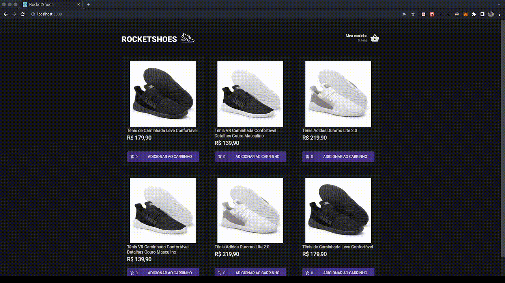

<div>
  <h1 align="center"> 
  Rocketshoes
  </h1>
  <h2 align="center"> 
  Creating a Shopping Cart Hook
  </h2>
  <h3 align="center"> 
  Module 2 - Challenge 1 - RocketSeat - Ignite ReactJS 🔥
  </h3>

  <p align="center">
    <a href="https://rocketseat.com.br">
      
    </a>
    <a href="https://github.com/jorgeeder"> 
      
    </a>
    
    
    <a href="https://opensource.org/licenses/MIT">
      
    </a>
  </p>
</div>

## About The Project

Project developed during the Rocketseat Ignite course in challenge 01 of chapter 02

## Features

- Add a new product to the cart;
- Remove a product from the cart;
- Change the quantity of a product in the cart;
- Calculation of sub-total and total cart prices;
- Stock validation;
- Display of error messages;

## Technologies

-   **[React](https://reactjs.org/)**
-   **[Typescript](https://www.typescriptlang.org/)**
-   **[Babel](https://babeljs.io/)**
-   **[Webpack](https://webpack.js.org/)**
-   **[Axios](https://github.com/axios/axios)**
-   **[react-icons](https://react-icons.github.io/react-icons/)**
-   **[react-toastify](https://github.com/fkhadra/react-toastify#readme)**
-   **[styled-components](https://styled-components.com/)**
-   **[polished](https://polished.js.org/)**
-   **[json-server](https://github.com/typicode/json-server)**

## Application in Use



## Requirement

- **[Git](https://git-scm.com)** 
- **[Node.js](https://nodejs.org/en/)**
- **[VSCode](https://code.visualstudio.com/)**

## Running The Project

```bash
# Clone this repository
$ git clone https://github.com/jorgeeder/rocketshoes-ignite-challenge-03

# Access the project folder in your terminal/cmd
$ cd rocketshoes-ignite-challenge-03

# Install dependencies
$ yarn # or npm install

# Run the server
$ yarn server # or npm run server

# Start the React application
$ yarn start # or npm run start

# The server will be running on port:3333 - go to http://localhost:3333
```
## License

This project is under the MIT license. See the [LICENSE](/LICENSE) file for more details.


<div align="center">
  <p> Made with 💜 by <a href="https://github.com/jorgeeder">Jorge Eder</a> </p>
  <p>
    <a href="https://www.linkedin.com/in/jorgeeder/">
      
    </a>
    <a href = "mailto:jorgeeder.dev@gmail.com">
      
    </a>
  </p>
</div>

